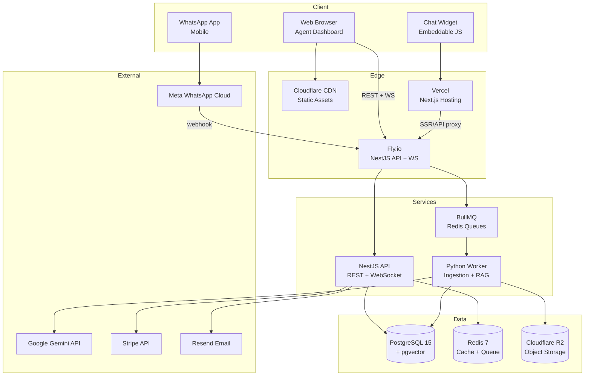
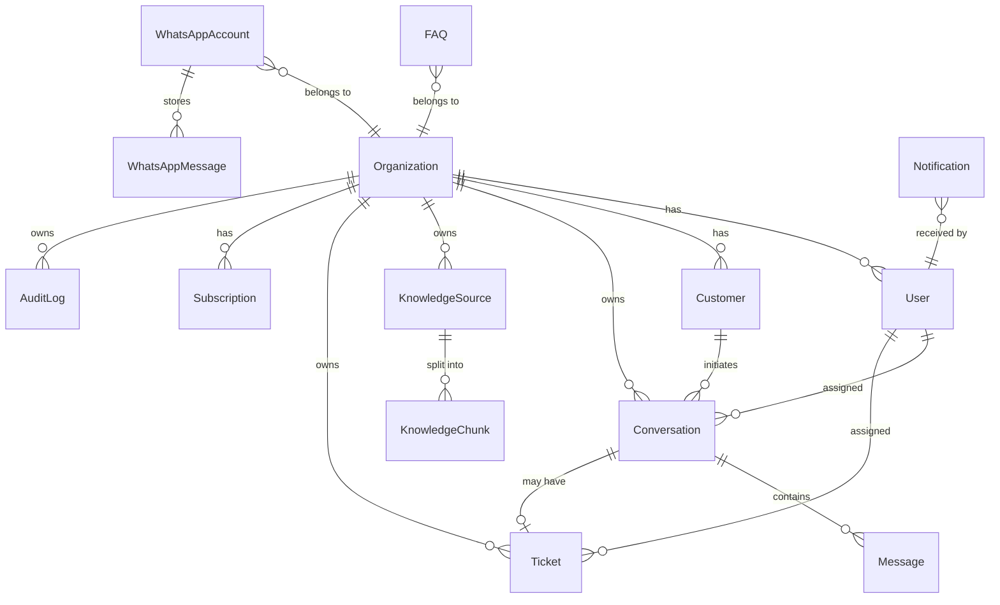
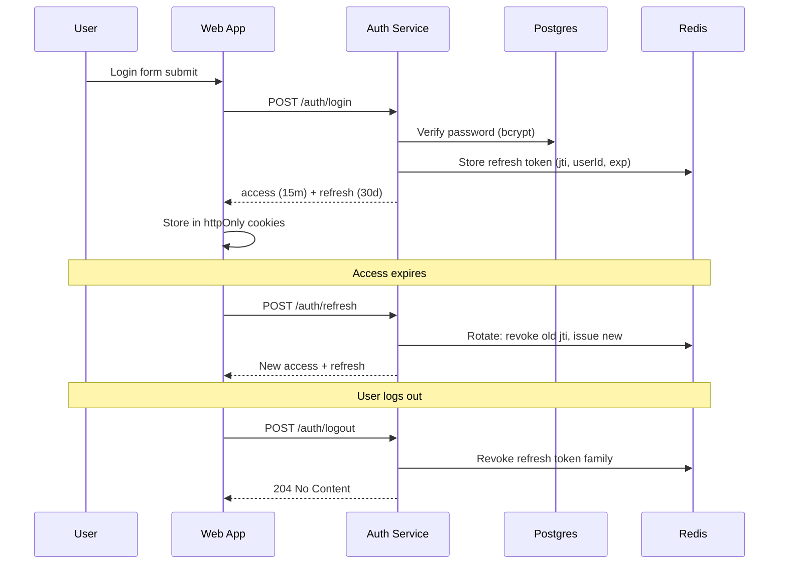
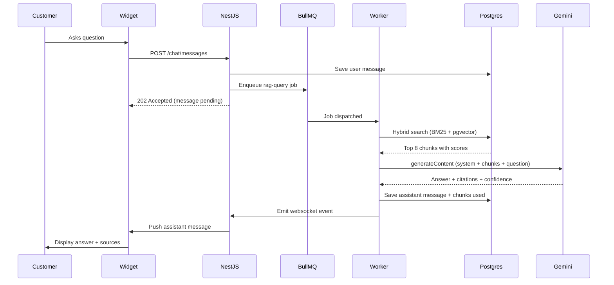
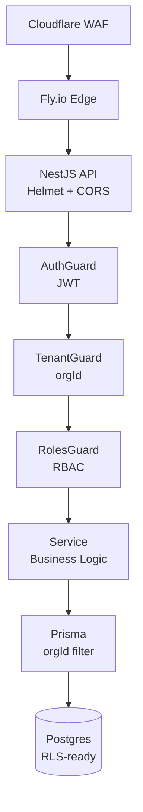

# Neo Support AI — Technical Architecture (ARCH)

**Version:** 1.0
**Status:** Approved
**Audience:** Engineers, SRE, Security
**Last updated:** 2026-06-23

---

## 1. Overview

Neo Support AI is a multi-tenant SaaS platform built as a monorepo containing a Next.js 15 web application, a NestJS 10 API, a Python ingestion worker, and shared TypeScript packages. This document describes the technical architecture, the rationale for technology choices, and the operational model that supports scale, security, and reliability.

---

## 2. High-Level Architecture



### 2.1 Request Flow Summary

1. Customer types in widget — `POST /api/chat/messages` (Next.js route proxies to NestJS)
2. API authenticates, validates, writes message, enqueues RAG job
3. Worker pulls job, embeds query against pgvector, calls Gemini, writes answer
4. API pushes answer back via WebSocket to widget
5. Agent dashboard subscribes via Socket.io for real-time updates

---

## 3. Tech Stack and Rationale

### 3.1 Frontend: Next.js 15 (App Router)

| Reason | Detail |
|---|---|
| React 19 + Server Components | Reduces JS shipped for dashboards; better SEO on marketing pages |
| Built-in API routes | Used as edge proxy for widget auth, embedding widget without exposing API key |
| Vercel-native deployment | Global edge, zero-config preview deploys |
| TypeScript strict | Type safety across monorepo |
| Middleware | Auth guard, tenant resolution at edge before SSR |
| Server Actions | Used for dashboard mutations to keep client code declarative |

**Rejected alternatives:** Remix (smaller ecosystem), Vite SPA (no SSR), pure React (rebuild auth/SSR ourselves).

### 3.2 Backend: NestJS 10

| Reason | Detail |
|---|---|
| Modular DI | Per-feature modules enforce clean boundaries |
| First-class TypeScript | Same types as frontend via shared `packages/contracts` |
| Decorator-based RBAC | `@Roles('admin')` integrates with Guards |
| WebSocket via `@nestjs/websockets` | Native Socket.io integration |
| OpenAPI generation | `@nestjs/swagger` produces accurate API docs from decorators |
| Mature ecosystem | BullMQ, Passport, Terminus, Pino all have NestJS adapters |

**Rejected alternatives:** Fastify alone (no opinionated structure), Express (no DI), Hono (too new for production SaaS).

### 3.3 Database: PostgreSQL 15 + pgvector

| Reason | Detail |
|---|---|
| ACID + relational integrity | Multi-tenant data needs strong consistency |
| pgvector extension | Vector similarity search without separate vector DB |
| pgcrypto for column encryption | Sensitive fields (PHI) encrypted at rest |
| Mature partitioning | Future-proof for messages table growth |
| JSONB for flexible metadata | Conversation metadata, RAG source config |
| pg_trgm for fallback text search | Hybrid search (BM25 + vector) |

**Rejected alternatives:** MongoDB (lacks transactional guarantees needed for billing), MySQL (weaker JSON + no vector), Pinecone (added vendor, data egress cost).

### 3.4 Cache and Queue: Redis 7 + BullMQ

| Reason | Detail |
|---|---|
| Cache + queue in one | Reduces infrastructure surface |
| BullMQ patterns | Delayed jobs, retries, rate-limited queues |
| Redis Streams | Future for event sourcing |
| Pub/Sub | Powers WebSocket horizontal scaling |

### 3.5 LLM: Google Gemini 2.5 Flash

| Reason | Detail |
|---|---|
| Cost | $0.075/1M input tokens — 10x cheaper than GPT-4o |
| Latency | Flash variant returns in <2s for typical prompts |
| Native multi-language | Out-of-box support for 12 languages |
| 1M context window | Allows passing 5+ RAG chunks without trimming |
| Function calling | Used for structured outputs (handoff decisions) |

**Fallback:** OpenAI GPT-4o-mini for transient outages (queue-based routing).

### 3.6 Storage: Cloudflare R2

| Reason | Detail |
|---|---|
| Zero egress fees | Critical for PDF downloads (analytics exports) |
| S3-compatible | Use battle-tested AWS SDK |
| Strong consistency | No stale reads on fresh uploads |

**Rejected alternatives:** S3 (egress costs), Supabase Storage (lower durability tier), GCS (egress costs).

### 3.7 Email: Resend

| Reason | Detail |
|---|---|
| Modern DX | React Email templates, type-safe |
| Generous free tier | 50k emails/month free |
| Reliable deliverability | Separate sending IP, DKIM auto-config |

### 3.8 Payments: Stripe

| Reason | Detail |
|---|---|
| Customer Portal | Self-service billing without our UI |
| Smart Retries | Built-in dunning logic |
| Tax automation | Stripe Tax for EU compliance |
| Idempotency keys | Safe webhook handling |

### 3.9 Hosting: Vercel (web) + Fly.io (API) + Supabase (DB) + R2 (storage)

| Service | What | Why |
|---|---|---|
| Vercel | Next.js | Best-in-class DX, edge functions |
| Fly.io | NestJS API + WS | Run apps near users; regional deploys; sticky sessions |
| Supabase | Postgres | Managed PG with pgvector, point-in-time recovery, branching |
| Cloudflare R2 | Object storage | S3-compatible, zero egress |

---

## 4. Service Architecture

### 4.1 Monorepo Layout

```
neo-support-ai/
├── apps/
│   ├── web/              # Next.js 15 (App Router)
│   │   ├── app/          # Pages + layouts
│   │   ├── components/   # React components (Mantine UI)
│   │   ├── lib/          # Client utilities
│   │   └── middleware.ts # Auth + tenant resolution
│   ├── api/              # NestJS 10 (REST + WebSocket)
│   │   ├── src/
│   │   │   ├── modules/  # auth, orgs, conversations, knowledge, ...
│   │   │   ├── common/   # guards, interceptors, decorators
│   │   │   ├── prisma/   # DB client
│   │   │   └── main.ts
│   │   └── test/         # Unit + e2e tests
│   └── worker/           # Python ingestion worker
│       ├── app/
│       │   ├── jobs/     # scrape, embed, pdf_parse
│       │   └── main.py
│       └── pyproject.toml
├── packages/
│   ├── contracts/        # Shared Zod schemas + TS types
│   ├── ui/               # Shared React components
│   └── config/           # ESLint, TSConfig, Tailwind presets
├── infra/
│   ├── fly.toml          # Fly.io config
│   ├── vercel.json       # Vercel config
│   └── supabase/         # SQL migrations
├── turbo.json
└── pnpm-workspace.yaml
```

### 4.2 Package Boundaries

| Package | Can Import From |
|---|---|
| `apps/web` | `@neo/contracts`, `@neo/ui`, `@neo/config` |
| `apps/api` | `@neo/contracts` |
| `apps/worker` | None (Python, separate type system) |
| `packages/contracts` | None |
| `packages/ui` | `@neo/contracts` |

Enforced by `eslint-plugin-import` boundaries rule.

### 4.3 Module Boundaries (API)

```
src/modules/
├── auth/         # Register, login, refresh, password reset
├── orgs/         # Organization CRUD
├── users/        # User CRUD + invitations + roles
├── customers/    # End-user customer records
├── conversations/# Conversation + messages
├── tickets/      # Tickets + comments
├── knowledge/    # Sources, chunks, FAQs
├── analytics/    # Aggregations
├── billing/      # Stripe sync
├── notifications/# In-app + email
├── audit/        # Audit log
├── chatbot/      # Bot config (handoff thresholds)
├── whatsapp/     # Meta integration
└── files/        # Upload + signed download
```

Each module owns: controller, service, repository (Prisma), DTOs (Zod), tests.

---

## 5. Data Model Overview



Full schema in `docs/SCHEMA.md`.

### 5.1 Multi-Tenancy Strategy

Every tenant-scoped table has `organizationId` as first column. Application-layer filtering via a Prisma middleware that injects `where: { organizationId }` automatically. Future hardening: Postgres Row-Level Security policies on critical tables.

---

## 6. Authentication Flow

### 6.1 JWT + Refresh Token Rotation



### 6.2 Refresh Token Rotation

- Access token TTL: 15 minutes (RS256, signed by API)
- Refresh token TTL: 30 days, single-use, rotated on each refresh
- Token family invalidation: if a rotated refresh token is replayed, the entire family is revoked (theft detection)

### 6.3 Multi-Tenant Isolation

- JWT payload includes `orgId`, `role`, `userId`
- Every authenticated request hits a `TenantGuard` that:
  1. Resolves `orgId` from JWT
  2. Injects into request context
  3. Prisma client auto-filters by `organizationId`

---

## 7. RAG Pipeline

### 7.1 Flow



### 7.2 Retrieval

- **Embedding model:** `text-embedding-004` (768 dims)
- **Hybrid search:** Weighted combination of `pg_trgm` similarity (BM25-style) and `pgvector` cosine
- **Top K:** 8 chunks per query (configurable per bot)
- **Re-ranking:** Gemini Flash re-ranks top 8 against the question

### 7.3 Generation

- System prompt includes: organization name, scope, refusal rules, citation format
- Response format enforced via response_schema (structured JSON: `answer`, `citations`, `confidence`, `handoff_needed`)
- Confidence threshold (default 0.6) controls handoff

---

## 8. WebSocket Architecture

### 8.1 Transport

Socket.io with Redis adapter for horizontal scaling. Channels:

| Channel | Audience | Events |
|---|---|---|
| `org:{orgId}` | All members of an org | `conversation:new`, `conversation:assigned` |
| `user:{userId}` | Single user | `notification:new`, `message:new` |
| `conv:{convId}` | Participants of a conversation | `message:new`, `typing`, `presence` |

### 8.2 Presence

- Server tracks `online:userId` in Redis with 30s TTL
- Refreshed on heartbeat every 15s
- Inactive agents show as away after 60s

### 8.3 Sticky Sessions

Fly.io uses `fly-force-instance-id` header to pin WS connections to a single instance for their lifetime.

---

## 9. Caching Strategy

| Layer | Key | TTL | Invalidation |
|---|---|---|---|
| API response cache (dashboard metrics) | `api:analytics:{orgId}:{range}` | 60s | On conversation/message write |
| RAG result cache | `rag:{orgId}:{queryHash}` | 1h | On source reprocess |
| Session lookup | `sess:{userId}` | 15m | On logout |
| Rate limit counters | `rl:{userId}:{bucket}` | 60s | TTL |
| BullMQ queues | (persistent) | n/a | n/a |

**Cache stampede prevention:** SWR pattern + jitter on TTL.

---

## 10. Security Architecture

### 10.1 Defense in Depth



### 10.2 Encryption

| Layer | Method |
|---|---|
| In Transit | TLS 1.3, HSTS preload |
| At Rest (DB) | AES-256 (pgcrypto for PHI columns) |
| At Rest (Objects) | AES-256 (R2 default, SSE-S3) |
| Application Secrets | env vars + Doppler secret manager |
| JWT Signing | RS256, key rotated quarterly |

### 10.3 RBAC

| Role | Permissions |
|---|---|
| Owner | Everything including billing, deletion |
| Admin | Everything except billing |
| Manager | All except billing, plus analytics |
| Agent | Conversations, tickets, knowledge |
| Viewer | Read-only on all |

### 10.4 Audit Log

Every state-changing action emits an AuditLog entry: actor, action, target, IP, user agent, timestamp, diff. Retained 7 years. Surfaced in dashboard for Owner/Admin.

---

## 11. Scalability

### 11.1 Horizontal Scaling

| Component | Strategy |
|---|---|
| API | Stateless behind Fly.io load balancer; scale on CPU > 60% |
| WebSocket | Sticky sessions; scale on connection count > 4,000/instance |
| Worker | Scale on queue lag > 2 min |
| Postgres | Read replicas at >100 GB or >5K RPS; connection pooling via PgBouncer |
| Redis | Cluster mode at >25 GB; 3 primaries, 3 replicas |

### 11.2 Vertical Scaling Thresholds

| Resource | Trigger |
|---|---|
| API instance | CPU > 70% sustained 5 min |
| DB | Connections > 80% pool |
| Redis | Memory > 75% |
| R2 | Request rate > 1K/s sustained |

---

## 12. Disaster Recovery

| Metric | Target |
|---|---|
| RPO (Recovery Point Objective) | 24 hours |
| RTO (Recovery Time Objective) | 4 hours |
| Backup Frequency | Daily snapshot + WAL archiving |
| Backup Retention | 30 days rolling |
| DR Drill | Quarterly |
| Multi-Region | US + EU active-active by Year 2 |

### 12.1 Failure Modes

| Failure | Mitigation |
|---|---|
| DB corruption | PITR from WAL; restore to new instance; replay |
| Region outage | Failover to secondary region via DNS health check |
| Worker pool down | Jobs queue in Redis; auto-restart on health probe failure |
| Stripe outage | Webhook queue retries with backoff; idempotent handler |
| Gemini outage | Queue overflows; fallback to GPT-4o-mini; user-facing banner |

---

## 13. Observability

### 13.1 Logging

- Structured JSON via Pino
- Shipped to BetterStack
- Correlation ID per request (header `x-request-id`)
- Sensitive fields auto-redacted (passwords, tokens, PHI markers)

### 13.2 Metrics

- Datadog: API latency, error rate, queue lag, cache hit rate
- Custom: bot resolution rate, CSAT, RAG retrieval precision

### 13.3 Tracing

- OpenTelemetry SDK in NestJS and Next.js
- Honeycomb backend
- Sample 10% of traffic, 100% of errors

### 13.4 Alerts

| Alert | Condition | Severity |
|---|---|---|
| API error rate | > 1% over 5 min | P2 |
| API p95 latency | > 2s over 10 min | P3 |
| Queue lag | > 5 min | P2 |
| DB connections | > 80% pool | P3 |
| Gemini error rate | > 5% over 5 min | P2 |
| Worker pool down | 0 workers healthy | P1 |

---

## 14. Deployment Architecture

### 14.1 Topology

```
Internet → Cloudflare (WAF, DDoS) → Fly.io Edge → Fly.io App (multi-region)
                                                       ├── sin (Singapore)
                                                       ├── iad (Virginia)
                                                       └── fra (Frankfurt)
                                                                 │
                                                                 ├── API containers (Node 20)
                                                                 ├── Worker containers (Python 3.12)
                                                                 └── Redis (Upstash)
                                                                 
Static assets → Vercel (global edge)
Database → Supabase (us-east-1, eu-west-1 for EU customers)
Objects → Cloudflare R2
```

### 14.2 CI/CD

- GitHub Actions
- PR: lint, type-check, unit tests, e2e tests
- Merge to main: deploy to staging
- Tag release: deploy to production with manual approval
- Database migrations run as separate job with explicit confirmation

---

## 15. Architecture Decision Records (ADRs)

### ADR-001: Monorepo with pnpm + Turborepo

**Context:** Three apps (web, api, worker) need shared types and tooling.

**Decision:** Use pnpm workspaces + Turborepo for build orchestration.

**Consequences:** (+) Shared types, single CI, atomic changes (-) Slower cold install, requires workspace discipline. Mitigated with Turborepo caching.

### ADR-002: Postgres + pgvector Over Pinecone

**Context:** Need vector search for RAG; want to minimize vendors.

**Decision:** Use pgvector inside our existing Postgres.

**Consequences:** (+) One DB to operate, transactional consistency with metadata (-) Slower at >10M vectors, less mature than dedicated vector DBs. Acceptable for MVP; revisit at scale.

### ADR-003: Gemini Flash Over GPT-4o for Default

**Context:** Need cost-effective LLM for high-volume chat.

**Decision:** Use Gemini 2.5 Flash as primary; GPT-4o-mini as fallback.

**Consequences:** (+) 10x cost reduction (-) Slightly weaker reasoning; mitigated with structured output + re-ranking.

### ADR-004: BullMQ Over AWS SQS

**Context:** Need delayed/retryable background jobs.

**Decision:** BullMQ on Redis.

**Consequences:** (+) Same infra as cache, powerful patterns (-) Redis becomes critical dependency; mitigated with persistent queue.

### ADR-005: Cloudflare R2 Over S3

**Context:** Need to serve PDF exports and uploaded files cheaply.

**Decision:** Cloudflare R2 with zero egress.

**Consequences:** (+) Dramatic cost savings on downloads (-) Smaller ecosystem. Acceptable trade.

---

**Last updated:** 2026-06-23
