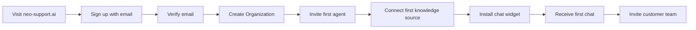
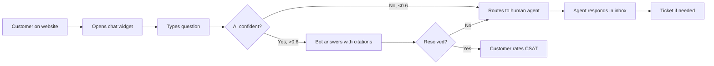

# Neo Support AI — Product Requirements Document (PRD)

**Version:** 1.0
**Status:** Approved for Engineering
**Owner:** Product Team
**Last updated:** 2026-06-23

---

## 1. Executive Summary

Neo Support AI is a multi-tenant, AI-first customer support platform built for service businesses that lose revenue every minute a question goes unanswered. By combining a retrieval-augmented generation (RAG) chatbot, omnichannel inbox (web chat + WhatsApp), ticketing, knowledge base management, and live analytics, Neo Support AI replaces legacy helpdesks with a single workspace where AI resolves 70-80 percent of routine inquiries and human agents focus on the 20 percent that drives retention.

The product targets a $48B helpdesk software market dominated by Zendesk ($1.7B ARR) and Intercom ($1.0B ARR). Neo Support AI enters through a wedge of mid-market service businesses (50-500 employees) in healthcare, education, real estate, and SMB e-commerce — segments underserved by tools priced for the enterprise. The product ships in 4 weeks as an MVP, monetizes through a freemium SaaS model starting at $49/month, and reaches break-even on infrastructure costs at approximately 200 paying customers.

---

## 2. Problem Statement

### 2.1 The Support Crisis

Modern service businesses lose customers at alarming rates due to slow, fragmented, and inconsistent support:

- **60% of customers** abandon a brand after a poor support experience (Microsoft Global State of Customer Service, 2025)
- **First-response time** on legacy helpdesks averages 12 hours; on WhatsApp, customers expect reply within 4 minutes (Twilio Customer Engagement Report)
- **Agent burnout**: Support agents spend 35% of their time searching for information, not serving customers (Forrester)
- **Knowledge silos**: 80% of institutional knowledge is locked in PDFs, Notion pages, and tribal memory, never reaching the front line

### 2.2 The Cost of Inaction

For a mid-market clinic with $5M annual revenue:

| Failure Mode | Annual Cost |
|---|---|
| 60% customer churn due to slow support | $900,000 lost LTV |
| 3 support agents @ $48K handling repetitive queries | $144,000 fully loaded |
| Missed after-hours inquiries (40% of total) | $240,000 opportunity loss |
| Compliance risks from inconsistent answers | $50,000 in audit/legal |
| **Total Exposure** | **$1.33M/year** |

### 2.3 Why Existing Tools Fail

| Tool | Why It Fails SMBs |
|---|---|
| Zendesk | $79/agent/month is 3x our target price; complex admin |
| Intercom | $74/seat + Fin AI add-on ($0.99/resolution) is unpredictable |
| Drift | Acquired by Salesloft, product investment paused |
| Tidio | Limited AI, weak WhatsApp, no RAG |
| Freshchat | Bundled in Freshworks ecosystem, hard to extract |

**No tool combines** AI-first resolution, WhatsApp-native messaging, transparent pricing, and an under-15-minute setup.

---

## 3. Solution Overview

Neo Support AI is the **AI Agent that knows your business**. Customers connect their help center (URLs, PDFs, Notion exports), and within 5 minutes they have a branded chatbot that:

1. **Resolves** the 70% of questions that are factual ("What are your hours?", "Do you accept Aetna?")
2. **Routes** the 20% that require human judgment ("I want a refund", "My prescription is wrong")
3. **Engages** on the channels customers already use (web chat widget, WhatsApp Business)

Agents and managers operate from a unified workspace — inbox, tickets, knowledge, analytics — that obsoletes 4 separate SaaS subscriptions.

### 3.1 Product Pillars

| Pillar | Outcome |
|---|---|
| AI-First Resolution | 70% deflection without sacrificing CSAT |
| Omnichannel Inbox | Web + WhatsApp in one thread |
| Knowledge as Code | Version-controlled, auto-scraped, reprocessable |
| Transparent Pricing | Per-seat pricing with no resolution surcharges |
| 15-Minute Time-to-Value | Signup to first chat in under 15 minutes |

### 3.2 What Ships in MVP

- AI chatbot (Gemini 2.5 Flash with RAG over customer knowledge)
- Web chat widget with branding
- WhatsApp Business Cloud integration
- Ticketing system with status, priority, assignment
- Knowledge base manager (URL scrape, PDF upload, manual FAQ)
- Analytics dashboard (resolution rate, response time, CSAT, ROI)
- Billing via Stripe (subscriptions + usage)
- Multi-tenant isolation, audit logging, RBAC

---

## 4. Target Market

### 4.1 Primary Segments

| Segment | Why Now | Beachhead Customer Profile |
|---|---|---|
| **Hospitals and Clinics** | Patient volume up 30% post-pandemic, staff shortages | 50-500 patient encounters/day, 3-20 staff |
| **Educational Institutions** | Students demand WhatsApp-native support | Coaching centers, training institutes, K-12 private schools |
| **Real Estate Agencies** | High lead volume, after-hours inquiries | 10-100 agents, 50-500 active listings |
| **E-Commerce SMBs** | Cart abandonment is a support failure | DTC brands, $1M-$20M GMV |
| **Local SMBs** | Cannot afford a helpdesk engineer | Salons, gyms, repair services, restaurants |

### 4.2 Total Addressable Market

| Layer | Calculation | Value |
|---|---|---|
| TAM | 5M SMB service businesses globally x $1,200/year | $6.0B |
| SAM | 800K English-speaking mid-market firms | $960M |
| SOM (Year 1) | 1,000 customers x $1,800 ARR average | $1.8M |
| SOM (Year 3) | 12,000 customers x $2,400 ARR average | $28.8M |

### 4.3 Why Mid-Market

Mid-market is the "Goldilocks zone" for Neo Support AI:

- Too large for a personal phone + spreadsheet
- Too small for a dedicated support engineer
- Too cost-sensitive for Zendesk Suite Professional
- Too growth-oriented for a static FAQ page

---

## 5. User Personas

### 5.1 Persona: Dr. Anjali Rao — The Practice Admin

| Attribute | Detail |
|---|---|
| Role | Operations Director at a multi-specialty clinic |
| Team Size | 35 staff, 4 front-desk agents |
| Technical Comfort | Moderate; uses Google Workspace daily |
| Primary Goal | Reduce call volume without losing patient satisfaction |
| Daily Pain | 200+ phone calls/day for "what are your hours?", "is my report ready?" |
| Success Metric | Reduce call volume by 40% in 90 days |
| Quote | "I want patients to get instant answers without my team becoming answering machines." |

### 5.2 Persona: Marco Silva — The Support Agent

| Attribute | Detail |
|---|---|
| Role | Tier-1 support at a real estate brokerage |
| Team Size | 12 agents, 200 leads/day |
| Technical Comfort | High; power user of CRMs |
| Primary Goal | Close deals faster, not get bogged down in repetitive questions |
| Daily Pain | 70% of inbound is "Is X still available?" — agents duplicate work |
| Success Metric | Handle 5x conversations/day at same quality |
| Quote | "If the bot could just tell them the price and book a tour, I'd never look back." |

### 5.3 Persona: Priya Kapoor — The End Customer

| Attribute | Detail |
|---|---|
| Role | Patient / homebuyer / student |
| Technical Comfort | WhatsApp-native, mobile-first |
| Primary Goal | Get an answer in 60 seconds, not 6 hours |
| Daily Pain | Web forms that go nowhere, phone trees, tickets with no reply |
| Success Metric | Time to resolution under 2 minutes |
| Quote | "If you can't answer me on WhatsApp, you don't exist." |

### 5.4 Persona: Vikram Mehta — The Support Manager

| Attribute | Detail |
|---|---|
| Role | Head of Customer Experience at a coaching company |
| Team Size | 18 agents across 2 shifts |
| Technical Comfort | Moderate; comfortable with dashboards |
| Primary Goal | Prove ROI to the CEO; coach underperforming agents |
| Daily Pain | No visibility into AI deflection; can't tie support to revenue |
| Success Metric | Show $200K/year cost savings vs. previous quarter |
| Quote | "I need numbers I can put in a board deck." |

---

## 6. Core Features

### 6.1 AI Chatbot with RAG

**Description:** Branded chat widget that answers questions grounded in the customer's own knowledge base.

- **Resolution Engine:** Gemini 2.5 Flash with hybrid search (BM25 + vector similarity)
- **Citation Display:** Every answer includes source title, URL, and confidence score
- **Handoff Logic:** Confidence below 0.6 or explicit human request routes to agent
- **Multilingual:** Supports 12 languages out-of-the-box via Gemini native capability
- **Guardrails:** Refuses questions outside scope, never invents pricing or policies

**Acceptance:** 70% of test queries from a representative knowledge base answered correctly without human intervention.

### 6.2 Knowledge Base Manager

**Description:** Self-service knowledge management with multiple ingestion paths.

- **URL Scraping:** Recursive crawl up to 500 pages per source
- **PDF Upload:** Up to 100 MB per file, text + table extraction
- **Manual FAQ:** Structured editor with markdown + categories
- **Version Control:** Re-process jobs are tracked; rollback to any prior version
- **Search Preview:** Test queries before publishing

**Acceptance:** Customer can scrape a 50-page help center and see 200+ indexed chunks within 10 minutes.

### 6.3 Omnichannel Inbox

**Description:** Single threaded view of conversations across web chat and WhatsApp.

- **Channel Auto-Detect:** Conversation metadata preserves channel, browser, location
- **Customer 360:** Order history, prior tickets, knowledge gaps all visible inline
- **Internal Notes:** Agent-to-agent notes that customers never see
- **Canned Responses:** Team-wide template library with `/` shortcuts
- **Typing Indicators and Read Receipts:** WhatsApp-grade UX

**Acceptance:** Agents handle web chat and WhatsApp from the same tab without switching tools.

### 6.4 Ticketing System

**Description:** Lightweight ticket layer for issues that span multiple conversations or require escalation.

- **Auto-Creation:** High-priority complaints or unresolvable bot queries become tickets
- **Status Workflow:** Open > In Progress > Waiting Customer > Resolved > Closed
- **Assignment:** Manual or round-robin to agents based on workload
- **SLA Tracking:** Time-in-status warnings before breach
- **Internal Comments:** Public customer replies + private team comments

**Acceptance:** Tickets carry full conversation history and customer context without manual copy-paste.

### 6.5 Analytics Dashboard

**Description:** Manager-facing metrics with exportable reports.

- **Overview:** Total conversations, resolution rate, CSAT, response time
- **Conversation Funnel:** Inquiries > Bot-resolved > Human-handled > Resolved
- **Agent Leaderboard:** Volume, CSAT, response time per agent
- **Knowledge Gaps:** Top questions the bot could not answer
- **ROI Calculator:** Cost saved vs. hypothetical human-only baseline

**Acceptance:** Manager can pull a weekly PDF report with one click.

### 6.6 Billing and Subscription

**Description:** Stripe-powered self-service billing.

- **Plan Tiers:** Free, Starter ($49), Pro ($199), Enterprise (custom)
- **Per-Seat Pricing:** Additional seats added at checkout
- **Usage-Based Add-Ons:** Additional WhatsApp numbers, RAG storage
- **Customer Portal:** Stripe-hosted invoices, plan changes, cancellation
- **Dunning:** Failed payment recovery via Stripe Smart Retries

**Acceptance:** Customer upgrades from Starter to Pro without contacting support.

---

## 7. User Journeys

### 7.1 Journey: New Customer Onboarding (Day 1)

**Time-to-Value Target:** Under 15 minutes from signup to first chat.

### 7.2 Journey: Customer Asks a Question

**Target Time:** Bot-resolved in under 8 seconds; human-routed in under 90 seconds.

### 7.3 Journey: Manager Reviews Performance

1. Logs in to dashboard
2. Sees weekly summary email with KPIs
3. Clicks into Conversations tab to inspect failures
4. Identifies 5 knowledge gaps from "unanswered" cluster
5. Adds FAQs to knowledge base
6. Re-processes source and sees deflection rate rise next week

---

## 8. Success Metrics

### 8.1 North Star Metric

**Weekly Resolved Conversations per Customer** — measures platform utility beyond vanity signups.

### 8.2 Acquisition Metrics

| Metric | Target (Q1) | Stretch (Q2) |
|---|---|---|
| Signup-to-Activation Rate | 35% | 50% |
| Activation-to-Paid Conversion | 8% | 12% |
| CAC Payback | 9 months | 6 months |

### 8.3 Engagement Metrics

| Metric | Target |
|---|---|
| Weekly Resolved Conversations / Customer | 50+ |
| Bot Resolution Rate | 65-75% |
| Median First Response Time | < 30 seconds (bot) / < 90 seconds (human) |
| CSAT | 4.4 / 5.0 |
| WAU/MAU | 50% |

### 8.4 Business Metrics

| Metric | Target (Year 1) |
|---|---|
| Paying Customers | 1,000 |
| Net Revenue Retention | 110% |
| Gross Margin | 78% |
| ARR | $1.8M |
| Logo Churn | < 3% monthly |

### 8.5 Operational Targets

| Metric | Target |
|---|---|
| 80% workload reduction vs. human-only baseline | Per-customer ROI dashboard |
| 90% CSAT | Rolling 30-day average |
| 5x ROI | First-year payback vs. legacy costs |

---

## 9. Competitor Analysis

### 9.1 Feature Matrix

| Feature | Neo Support AI | Intercom | Zendesk | Drift | Tidio | Freshchat |
|---|---|---|---|---|---|---|
| AI Resolution (RAG) | Yes (native) | Yes (Fin, +$0.99) | Yes (add-on) | Limited | Basic | Limited |
| WhatsApp Native | Yes | Add-on | Add-on | No | Limited | Yes |
| Web Chat Widget | Yes | Yes | Yes | Yes | Yes | Yes |
| Ticketing | Yes | Yes | Yes | No | Basic | Yes |
| Knowledge Base | Built-in | Add-on | Yes | No | No | Add-on |
| Transparent Pricing | Yes (per-seat) | No (per-resolution) | No (tiered) | No | Yes | No |
| Setup Time | 15 min | 2 hours | 4 hours | 1 hour | 30 min | 3 hours |
| Multi-Tenant | Yes | Yes | Yes | Yes | Yes | Yes |
| Open API | Yes | Yes | Yes | Limited | Yes | Yes |
| Self-Hosted Option | Roadmap | No | No | No | No | No |

### 9.2 Pricing Comparison

| Tool | Entry Plan | Mid-Tier | Enterprise | Hidden Costs |
|---|---|---|---|---|
| **Neo Support AI** | $0 (Free, 100/mo) | $49/mo (Starter) | $199/mo (Pro) | None |
| Intercom | $74/seat | $148/seat + $0.99/resolution | Custom | Resolution fees |
| Zendesk | $55/agent | $115/agent | Custom | Marketplace add-ons |
| Drift | Removed | Custom | Custom | Premium sales only |
| Tidio | $0 (Free) | $29/mo (Starter) | $749/mo (Tidio+) | Plus add-ons |
| Freshchat | $0 (Free) | $15/agent | $79/agent | Bundled with Freshworks |

### 9.3 Competitive Positioning

Neo Support AI occupies the only quadrant with **transparent pricing + native WhatsApp + AI-first resolution** at sub-$200/month. We do not compete on feature breadth (Zendesk wins) or sales-led motion (Intercom wins) — we compete on **speed-to-value and TCO predictability**.

---

## 10. Revenue Model

### 10.1 Plan Structure

| Plan | Monthly Price | Seats | Conversations/mo | Storage | WhatsApp Numbers | RAG Sources |
|---|---|---|---|---|---|---|
| **Free** | $0 | 2 | 100 | 100 MB | 0 | 1 |
| **Starter** | $49 | 5 | 2,500 | 1 GB | 1 | 5 |
| **Pro** | $199 | 15 | 15,000 | 10 GB | 3 | 25 |
| **Enterprise** | Custom | Unlimited | Unlimited | Custom | Unlimited | Unlimited |

### 10.2 Add-On Pricing

| Add-On | Price |
|---|---|
| Additional Seat | $12/seat/month |
| Additional Conversation Block (10K) | $29 |
| Additional RAG Source Block (50) | $19 |
| Additional WhatsApp Number | $25/month |
| Additional Storage (10 GB) | $9 |

### 10.3 Unit Economics

| Metric | Value |
|---|---|
| Average Revenue Per Account (ARPA) | $147/month |
| Gross Margin | 78% |
| Variable Cost per Customer (inference + storage) | $32/month |
| LTV | $3,528 (24-month avg lifetime) |
| CAC Target | $750 |
| LTV:CAC | 4.7:1 |

### 10.4 Path to $1M ARR

| Milestone | Customers | ARR |
|---|---|---|
| Q1 end | 80 | $141K |
| Q2 end | 220 | $388K |
| Q3 end | 430 | $758K |
| Q4 end | 570 | $1.0M |

---

## 11. Go-to-Market Strategy

### 11.1 Phase 1: Product-Led Growth (Months 1-3)

- **Free Tier:** 100 conversations/month, no credit card required
- **In-App Virality:** Shared inbox invites, embed code with attribution
- **Public Roadmap:** Canny board for community feature requests
- **Onboarding Email Sequence:** 7-touch sequence over 14 days

### 11.2 Phase 2: Content Marketing (Months 2-6)

- **SEO Hub:** 50 articles targeting "how to" support queries
- **Comparison Pages:** vs. Intercom, vs. Zendesk, vs. Tidio (programmatic SEO)
- **Case Studies:** 1 per vertical, written with paying customers
- **YouTube Channel:** 4 videos/month showing 15-minute setup

### 11.3 Phase 3: Partner Channels (Months 4-9)

- **Agencies:** 20% revenue share for resellers managing 5+ clients
- **WhatsApp Solution Providers:** Co-marketing in Meta directories
- **Industry Consultants:** Healthcare and education specialist referrals
- **Tech Partners:** Stripe Atlas, Supabase, Vercel co-marketing

### 11.4 Phase 4: Outbound (Months 6+)

- **Account-Based Marketing:** Target list of 1,000 mid-market service firms
- **LinkedIn Ads:** Thought leadership to support leaders and COOs
- **Webinar Series:** Monthly "AI Support Masterclass" lead magnet

---

## 12. Risks and Mitigations

| Risk | Likelihood | Impact | Mitigation |
|---|---|---|---|
| LLM cost spikes | Medium | High | Tiered model (Flash vs. Pro); cache RAG results aggressively |
| WhatsApp API policy changes | Low | High | Multi-region Meta partnership; SMS fallback built into roadmap |
| Customer churn after first AI failure | Medium | High | Confidence thresholds + instant human handoff + weekly quality reviews |
| Slow knowledge ingestion on large help centers | Medium | Medium | Background jobs, progress UI, manual chunk upload for edge cases |
| Competitor price war | Low | Medium | Differentiate on transparency + WhatsApp, not price |
| Data privacy concerns (healthcare, education) | High | High | SOC 2 Type I target by month 12; HIPAA-ready architecture from day 1 |
| Gemini outage / quota | Low | High | Multi-provider fallback (OpenAI) in roadmap; queueing during outages |
| Stripe webhook delays | Low | Low | Local cache + reconciliation job; idempotent webhook handler |

---

## 13. Out of Scope (MVP)

To preserve focus and ship in 4 weeks, the following are explicitly **out of scope** for MVP:

- Voice / phone support
- SMS (Twilio)
- Instagram / Messenger / Telegram channels
- Mobile apps (iOS / Android)
- Custom AI model training
- On-premise / self-hosted deployment
- Advanced workflow automation (Zapier-grade)
- Multilingual UI (English-only at launch)
- White-label reselling

These are documented in the roadmap for post-MVP.

---

## 14. Appendix

### 14.1 Glossary

- **RAG:** Retrieval-Augmented Generation — AI technique that grounds answers in retrieved documents
- **Deflection:** Percentage of inquiries resolved without human agent involvement
- **CSAT:** Customer Satisfaction Score (1-5 average from post-resolution survey)
- **MAU / WAU:** Monthly / Weekly Active Users
- **ARR / MRR:** Annual / Monthly Recurring Revenue
- **NPS:** Net Promoter Score
- **RLS:** Row-Level Security (database isolation)

### 14.2 References

- Microsoft Global State of Customer Service 2025
- Twilio Customer Engagement Report 2025
- Forrester The State of Customer Service 2025
- Gartner Market Guide for Conversational AI 2025
- Stripe SaaS Pricing Report 2025

---

**Last updated:** 2026-06-23
