# Neo Support AI — MVP Development Roadmap (ROADMAP)

**Version:** 1.0
**Horizon:** 12 months (MVP + post-MVP + Year 1)
**Status:** Approved
**Last updated:** 2026-06-23

---

## 1. Overview

This roadmap delivers a production-grade MVP in 4 weeks, then layers on post-MVP features based on customer demand and platform stability. We follow a phase-gate model: each phase has explicit success criteria, and we do not advance until they are met.

### 1.1 Phase Summary

| Phase | Window | Goal | Outcome |
|---|---|---|---|
| **Phase 0** | Week 1 | Foundations | Repo, infra, auth, DB live |
| **Phase 1** | Week 2 | Core AI | Chatbot + RAG working end-to-end |
| **Phase 2** | Week 3 | Channels + Ops | Tickets, WhatsApp, analytics |
| **Phase 3** | Week 4 | Hardening | Tests, deploy, launch |
| **Post-MVP** | Months 2-3 | Differentiators | Voice, advanced AI, marketplace |
| **Year 1** | Months 4-12 | Scale | Mobile, multi-region, enterprise |

---

## 2. Phase 0 — Foundations (Week 1)

### 2.1 Goals

Stand up the monorepo, infrastructure, and authentication so that subsequent phases have a stable platform.

### 2.2 Deliverables

- [ ] Monorepo initialized with pnpm + Turborepo
- [ ] `apps/web` (Next.js 15) running locally
- [ ] `apps/api` (NestJS 10) running locally
- [ ] `apps/worker` (Python 3.12) running locally
- [ ] Postgres 15 + pgvector running via Docker
- [ ] Redis 7 running via Docker
- [ ] Prisma schema with all 22 tables migrated
- [ ] JWT auth: register, login, refresh, logout, password reset
- [ ] Email service (Resend) wired
- [ ] Audit log emitting
- [ ] RBAC with 5 roles
- [ ] Multi-tenant filter middleware
- [ ] CI/CD pipeline (GitHub Actions) running lint + test
- [ ] Vercel preview deploys enabled
- [ ] Fly.io staging environment live
- [ ] Doppler secrets management configured
- [ ] Sentry error tracking installed
- [ ] BetterStack log shipping working
- [ ] Status page stub at status.neo-support.ai

### 2.3 Success Criteria

| Criterion | Target |
|---|---|
| All apps boot locally in < 2 min | Pass |
| Auth round-trip (register -> login -> refresh) | < 500ms |
| Test coverage on auth module | >= 80% |
| Staging URL accessible | Pass |
| Error tracking receives test event | Pass |
| Lint clean | 0 errors |

### 2.4 Risks

| Risk | Mitigation |
|---|---|
| Monorepo setup friction | Use official pnpm + Turborepo templates |
| RLS misconfiguration | Integration tests assert tenant isolation |
| Secret management complexity | Doppler from day 1, no .env in production |

---

## 3. Phase 1 — Core AI (Week 2)

### 3.1 Goals

Deliver the AI chatbot with RAG that actually answers customer questions.

### 3.2 Deliverables

- [ ] Knowledge source model: URL scrape, PDF upload, manual FAQ
- [ ] BullMQ queue for scrape + embed jobs
- [ ] Python worker with scrapy/playwright for URL crawl
- [ ] PDF parser (pdf-parse + Tesseract OCR)
- [ ] Embedding pipeline using `text-embedding-004`
- [ ] pgvector index for similarity search
- [ ] Hybrid retrieval (vector + trigram)
- [ ] Re-ranking with Gemini Flash
- [ ] Chat endpoint with confidence score
- [ ] Citation display in messages
- [ ] Chat widget embeddable JS (loadable from CDN)
- [ ] Conversation persistence
- [ ] Customer creation on first chat
- [ ] Confidence threshold + handoff logic
- [ ] Admin UI to test queries against sources
- [ ] Knowledge base manager UI

### 3.3 Success Criteria

| Criterion | Target |
|---|---|
| Scrape 50-page site into > 200 chunks | < 10 min |
| PDF (50 pages) parses with < 5% error | Pass |
| RAG retrieval top-8 precision@5 | >= 0.75 |
| Bot first response p95 | < 8s |
| Widget loads on third-party site | < 100ms JS |
| Citation visible on every bot answer | Pass |

### 3.4 Risks

| Risk | Mitigation |
|---|---|
| Scrape failures on JS-heavy sites | Use Playwright; allow manual upload fallback |
| Embedding cost spike | Cache embeddings; batch calls |
| Hallucination | Confidence threshold + grounding prompt |

---

## 4. Phase 2 — Channels and Operations (Week 3)

### 4.1 Goals

Enable WhatsApp, ticketing, and analytics so the platform is operationally complete.

### 4.2 Deliverables

- [ ] WhatsApp embedded signup flow
- [ ] WhatsApp webhook receiver (verification + events)
- [ ] Outbound message API with 24h window handling
- [ ] WhatsApp templates management
- [ ] Conversation inbox UI (filters, search, realtime)
- [ ] Agent message composition (text, images, files)
- [ ] Internal notes
- [ ] Canned responses with `/` shortcuts
- [ ] Typing indicators via WebSocket
- [ ] Read receipts via WebSocket
- [ ] Ticket auto-creation from priority complaints
- [ ] Ticket status workflow
- [ ] Round-robin assignment
- [ ] SLA tracking
- [ ] Ticket detail page
- [ ] Analytics: overview dashboard
- [ ] Analytics: agent leaderboard
- [ ] Analytics: knowledge gaps report
- [ ] Analytics: ROI calculator
- [ ] CSV export
- [ ] Notification center (in-app + email)

### 4.3 Success Criteria

| Criterion | Target |
|---|---|
| Inbound WhatsApp latency (webhook to inbox) | < 3s |
| Outbound WhatsApp success rate | > 99% |
| WebSocket reconnect after network blip | < 2s |
| Dashboard load time | < 2s |
| 100-message conversation renders | < 500ms |

### 4.4 Risks

| Risk | Mitigation |
|---|---|
| WhatsApp template rejection | Pre-approved templates; graceful fallback to text |
| WebSocket scaling issues | Sticky sessions + Redis adapter |
| Notification spam | Per-user throttle + digest mode |

---

## 5. Phase 3 — Hardening and Launch (Week 4)

### 5.1 Goals

Make the platform production-ready and ship it.

### 5.2 Deliverables

- [ ] Stripe checkout + customer portal
- [ ] Stripe webhook handlers
- [ ] Plan limits enforced (seats, conversations, storage)
- [ ] Usage-based soft warnings + hard caps
- [ ] File upload + R2 storage
- [ ] E2E tests for critical flows (Playwright)
- [ ] Load test (k6 1,000 concurrent users)
- [ ] Security audit (external firm or in-house)
- [ ] Penetration test on staging
- [ ] WCAG 2.1 AA audit + fixes
- [ ] Documentation: PRD, SRS, ARCH, SCHEMA, API, DEPLOY, ROADMAP
- [ ] Marketing site (landing page, pricing, signup)
- [ ] Privacy policy + Terms of Service
- [ ] Cookie consent
- [ ] Onboarding email sequence
- [ ] Customer support inbox (support@neo-support.ai)
- [ ] Post-mortem template
- [ ] Runbooks for common incidents
- [ ] Backup + restore drill
- [ ] DR plan published
- [ ] Launch checklist completed

### 5.3 Success Criteria

| Criterion | Target |
|---|---|
| API p95 latency under load | < 500ms |
| 99.9% uptime during 7-day soak | Pass |
| Zero critical security findings | Pass |
| WCAG AA verified | Pass |
| 5 E2E test suites passing | Pass |
| Load test: 1,000 concurrent users | No errors |
| Documentation published | All 7 docs live |
| Production deploys without rollback | Pass |

### 5.4 Risks

| Risk | Mitigation |
|---|---|
| Last-minute bugs | Daily demos; freeze on Friday |
| Stripe integration edge cases | Test mode + live small charge |
| Marketing site SEO | Programmatic SEO pages pre-launch |

---

## 6. Launch Week (Day 28)

- Day 28 (Friday): Production deploy
- Day 29 (Saturday): Smoke test, on-call rotation active
- Day 30 (Sunday): Soft launch to 10 beta customers
- Day 31 (Monday): Public launch on Product Hunt
- Day 32+: Monitor, iterate, gather feedback

---

## 7. Post-MVP (Months 2-3)

### 7.1 Goals

Layer on differentiators that competitors lack.

### 7.2 Features

| Feature | Target | Owner |
|---|---|---|
| Voice support (Twilio + Gemini Live) | Month 2 | Backend |
| SMS support (Twilio) | Month 2 | Backend |
| Instagram DM | Month 2 | Backend |
| Multilingual UI (5 languages) | Month 2 | Frontend |
| Custom AI model training (per-customer fine-tune) | Month 2 | ML |
| Advanced workflow automation (Zapier-like) | Month 3 | Backend |
| Marketplace (3rd-party integrations: Salesforce, HubSpot) | Month 3 | Backend |
| White-label reselling | Month 3 | Backend |
| On-premise / self-hosted | Month 3 | DevOps |
| SOC 2 Type I | Month 3 | Compliance |

### 7.3 Success Metrics (Post-MVP)

| Metric | Target |
|---|---|
| Paid customers | 250 |
| MRR | $40K |
| Net Revenue Retention | 105% |
| Logo churn | < 5% monthly |

---

## 8. Year 1 Roadmap (Months 4-12)

### 8.1 Q2 (Months 4-6): Scale the Wedge

- Mobile apps (iOS + Android, React Native)
- Multi-region active-active (US + EU)
- Enterprise SSO (SAML, OIDC)
- Audit log search + export
- Advanced analytics (cohort, funnel)
- A/B testing framework
- Public API + webhooks for customers

### 8.2 Q3 (Months 7-9): Enterprise-Ready

- SCIM provisioning
- Custom roles + permissions
- HIPAA BAA flow
- SOC 2 Type II (annual audit)
- Advanced SLAs (99.95%, 99.99%)
- Dedicated support tier
- Onboarding services
- Custom data retention policies

### 8.3 Q4 (Months 10-12): Platform Play

- AI agent marketplace (3rd-party skills)
- Custom GPTs per customer
- Multi-brand (multiple orgs under one account)
- White-label full platform
- Channel partner program (20% rev share)
- International expansion (LATAM, APAC)

### 8.4 Year 1 Targets

| Metric | Target |
|---|---|
| Paying customers | 1,000 |
| ARR | $1.8M |
| Gross margin | 78% |
| Team size | 25 |
| Markets | US, EU, India, Brazil |
| Languages | English, Spanish, Portuguese, French, German, Hindi |

---

## 9. Risk Register (Active)

| ID | Risk | Likelihood | Impact | Owner | Status | Mitigation |
|---|---|---|---|---|---|---|
| R1 | LLM cost spike | Medium | High | Eng Lead | Active | Flash by default; cache RAG results; tiered pricing |
| R2 | WhatsApp API policy change | Low | High | Product | Monitoring | Multi-region Meta partnership; SMS fallback |
| R3 | Customer churn after first AI failure | Medium | High | CS Lead | Active | Confidence thresholds + human handoff + QA |
| R4 | Slow knowledge ingestion | Medium | Medium | Eng | Mitigated | Background jobs + progress UI |
| R5 | Competitor price war | Low | Medium | Product | Watching | Differentiate on transparency + WhatsApp |
| R6 | Data privacy (healthcare) | High | High | Compliance | Active | HIPAA-ready arch; SOC 2 by Month 12 |
| R7 | Gemini outage / quota | Low | High | Eng | Mitigated | OpenAI fallback in roadmap |
| R8 | Stripe webhook delays | Low | Low | Eng | Mitigated | Idempotent handler + reconciliation |
| R9 | Talent acquisition (ML eng) | High | High | CEO | Active | Equity + remote-first |
| R10 | Burn rate exceeds plan | Medium | High | CFO | Watching | Monthly reviews; cost caps |

---

## 10. Key Metrics to Track

### 10.1 Acquisition

| Metric | Tool | Frequency |
|---|---|---|
| Signups | Plausible + DB | Daily |
| Activation rate | DB query | Daily |
| Conversion to paid | Stripe | Daily |
| CAC by channel | Mixpanel | Weekly |
| Organic vs. paid share | Analytics | Weekly |

### 10.2 Engagement

| Metric | Tool | Frequency |
|---|---|---|
| WAU / MAU | DB | Daily |
| Conversations per customer | DB | Daily |
| Bot resolution rate | DB | Daily |
| Median first response time | DB | Daily |
| CSAT (rolling 30-day) | DB | Daily |

### 10.3 Operational

| Metric | Tool | Frequency |
|---|---|---|
| API p95 latency | Datadog | Realtime |
| Queue lag | Datadog | Realtime |
| Error rate | Sentry | Realtime |
| Worker pool size | Fly.io | Realtime |
| DB connection pool | Supabase | Realtime |

### 10.4 Financial

| Metric | Tool | Frequency |
|---|---|---|
| MRR / ARR | Stripe | Daily |
| Net Revenue Retention | DB + Stripe | Monthly |
| Gross margin | DB + Stripe | Monthly |
| CAC payback | DB + Stripe | Monthly |
| Cash on hand | Brex | Daily |

---

## 11. Dependencies and Sequencing

```mermaid
graph LR
    P0[Phase 0: Foundations] --> P1[Phase 1: Core AI]
    P1 --> P2[Phase 2: Channels + Ops]
    P2 --> P3[Phase 3: Hardening]
    P3 --> L[Launch]
    L --> PM1[Post-MVP: Differentiators]
    PM1 --> Y1Q2[Year 1 Q2: Scale]
    Y1Q2 --> Y1Q3[Year 1 Q3: Enterprise]
    Y1Q3 --> Y1Q4[Year 1 Q4: Platform]
```

Critical path: Phase 0 -> Phase 1 -> Phase 2 -> Phase 3 -> Launch. Any slip in these phases delays the public launch.

---

## 12. Decision Log

| Date | Decision | Rationale | Status |
|---|---|---|---|
| 2026-06-01 | Use Gemini Flash as default LLM | 10x cheaper than GPT-4o, native multilingual | Approved |
| 2026-06-01 | Postgres + pgvector over Pinecone | One DB, transactional consistency | Approved |
| 2026-06-08 | Monorepo with pnpm + Turborepo | Shared types, atomic changes | Approved |
| 2026-06-15 | Fly.io over Railway for API | Sticky sessions, multi-region | Approved |
| 2026-06-22 | Defer voice to Month 2 | Focus on chat + WhatsApp for MVP | Approved |

---

**Last updated:** 2026-06-23
