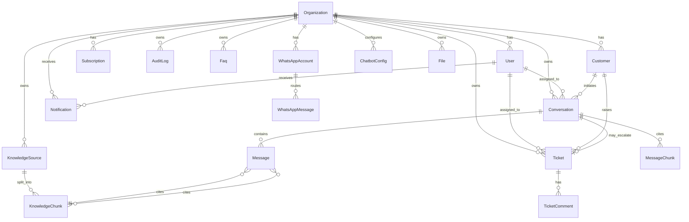

# Neo Support AI — Database Schema (SCHEMA)

**Version:** 1.0
**Status:** Approved
**Engine:** PostgreSQL 15 with pgvector, uuid-ossp, pgcrypto, pg_trgm
**Last updated:** 2026-06-23

---

## 1. Entity Relationship Diagram



---

## 2. Multi-Tenancy Strategy

Every business-data table has `organizationId UUID NOT NULL` as the leading foreign key, indexed, and enforced via application-layer Prisma middleware that automatically filters by the request's tenant context. The pattern is:

```sql
CREATE POLICY org_isolation ON {table}
  USING (organization_id = current_setting('app.org_id')::uuid);
```

Row-Level Security (RLS) policies are installed in production as defense-in-depth. In dev, the application layer alone enforces isolation. All cross-tenant queries are forbidden and detected by integration tests.

---

## 3. Extensions

| Extension | Purpose |
|---|---|
| `uuid-ossp` | `uuid_generate_v4()` for primary keys |
| `pgcrypto` | `pgp_sym_encrypt` for PHI columns |
| `pgvector` | Vector similarity for RAG retrieval |
| `pg_trgm` | Trigram indexes for BM25-style text fallback |
| `citext` | Case-insensitive email fields |

---

## 4. Tables

### 4.1 organizations

**Purpose:** Top-level tenant. One row per paying customer.

| Column | Type | Constraints | Description |
|---|---|---|---|
| id | UUID | PK, default uuid_generate_v4() | Primary key |
| name | VARCHAR(120) | NOT NULL | Org display name |
| slug | VARCHAR(60) | UNIQUE, NOT NULL | URL-friendly handle |
| timezone | VARCHAR(60) | NOT NULL, default 'UTC' | IANA TZ |
| locale | VARCHAR(10) | NOT NULL, default 'en-US' | UI locale |
| plan | plan_enum | NOT NULL, default 'free' | Current plan tier |
| stripe_customer_id | VARCHAR(60) | UNIQUE | Stripe customer ID |
| created_at | TIMESTAMPTZ | NOT NULL, default now() | Creation time |
| updated_at | TIMESTAMPTZ | NOT NULL, default now() | Last update |

**Indexes:** PK(id), UNIQUE(slug), UNIQUE(stripe_customer_id), INDEX(plan).

**Sample query:**
```sql
SELECT id, name, plan FROM organizations WHERE slug = 'anjali-clinic';
```

---

### 4.2 users

**Purpose:** Human users (agents, admins, owners) within an organization.

| Column | Type | Constraints | Description |
|---|---|---|---|
| id | UUID | PK | Primary key |
| organization_id | UUID | FK organizations(id), NOT NULL | Tenant |
| email | CITEXT | UNIQUE, NOT NULL | Login email |
| password_hash | VARCHAR(120) | NULL | bcrypt; null for OAuth-only |
| name | VARCHAR(120) | NOT NULL | Display name |
| role | user_role_enum | NOT NULL, default 'agent' | Owner/Admin/Manager/Agent/Viewer |
| avatar_url | TEXT | NULL | Profile photo |
| last_seen_at | TIMESTAMPTZ | NULL | Presence |
| is_active | BOOLEAN | NOT NULL, default true | Soft disable |
| created_at | TIMESTAMPTZ | NOT NULL | |
| updated_at | TIMESTAMPTZ | NOT NULL | |

**Indexes:** PK(id), UNIQUE(email), INDEX(organization_id), INDEX(role).

---

### 4.3 refresh_tokens

**Purpose:** JWT refresh token storage with rotation.

| Column | Type | Constraints | Description |
|---|---|---|---|
| id | UUID | PK | |
| user_id | UUID | FK users(id), NOT NULL | Owner |
| jti | UUID | UNIQUE, NOT NULL | JWT ID |
| token_hash | VARCHAR(120) | NOT NULL | bcrypt of refresh |
| family_id | UUID | NOT NULL | Rotation family |
| is_revoked | BOOLEAN | NOT NULL, default false | Revocation flag |
| expires_at | TIMESTAMPTZ | NOT NULL | 30-day TTL |
| created_at | TIMESTAMPTZ | NOT NULL | |

**Indexes:** PK(id), UNIQUE(jti), INDEX(user_id), INDEX(family_id).

---

### 4.4 customers

**Purpose:** End-user customers who chat with the bot/agents. Distinct from `users` (internal staff).

| Column | Type | Constraints | Description |
|---|---|---|---|
| id | UUID | PK | |
| organization_id | UUID | FK organizations(id), NOT NULL | |
| external_id | VARCHAR(120) | NULL | Customer's ID in their own system |
| name | VARCHAR(120) | NULL | |
| email | CITEXT | NULL | |
| phone | VARCHAR(30) | NULL | E.164 for WhatsApp |
| metadata | JSONB | NOT NULL, default '{}' | Custom attributes |
| created_at | TIMESTAMPTZ | NOT NULL | |
| updated_at | TIMESTAMPTZ | NOT NULL | |

**Indexes:** PK(id), INDEX(organization_id, email), INDEX(organization_id, phone).

---

### 4.5 conversations

**Purpose:** Threaded interaction between customers and bot/agents.

| Column | Type | Constraints | Description |
|---|---|---|---|
| id | UUID | PK | |
| organization_id | UUID | FK, NOT NULL | |
| customer_id | UUID | FK customers(id), NOT NULL | Initiator |
| assigned_user_id | UUID | FK users(id), NULL | Agent if assigned |
| channel | channel_enum | NOT NULL | web / whatsapp |
| status | conv_status_enum | NOT NULL, default 'open' | open/pending/resolved/closed |
| subject | VARCHAR(200) | NULL | Optional summary |
| metadata | JSONB | NOT NULL, default '{}' | Browser, page, location |
| last_message_at | TIMESTAMPTZ | NULL | For sorting |
| resolved_at | TIMESTAMPTZ | NULL | |
| created_at | TIMESTAMPTZ | NOT NULL | |
| updated_at | TIMESTAMPTZ | NOT NULL | |

**Indexes:** PK(id), INDEX(organization_id, status, last_message_at DESC), INDEX(organization_id, assigned_user_id).

---

### 4.6 messages

**Purpose:** Individual entries in a conversation.

| Column | Type | Constraints | Description |
|---|---|---|---|
| id | UUID | PK | |
| organization_id | UUID | FK, NOT NULL | Denormalized for RLS |
| conversation_id | UUID | FK conversations(id), NOT NULL | |
| sender_type | sender_enum | NOT NULL | customer/agent/bot/system |
| sender_id | UUID | NULL | user_id or customer_id |
| content | TEXT | NOT NULL | Body |
| content_type | content_enum | NOT NULL, default 'text' | text/image/file |
| is_internal_note | BOOLEAN | NOT NULL, default false | Agent-only note |
| confidence | REAL | NULL | Bot confidence if sender=bot |
| csat_score | SMALLINT | NULL | 1-5 from customer |
| created_at | TIMESTAMPTZ | NOT NULL | |

**Indexes:** PK(id), INDEX(conversation_id, created_at), INDEX(organization_id, created_at DESC).

---

### 4.7 message_chunks (join table)

**Purpose:** Citations — links a message to knowledge chunks used.

| Column | Type | Constraints |
|---|---|---|
| message_id | UUID | FK messages(id), NOT NULL |
| chunk_id | UUID | FK knowledge_chunks(id), NOT NULL |
| score | REAL | NOT NULL |
| rank | SMALLINT | NOT NULL |

**Indexes:** PK(message_id, chunk_id), INDEX(chunk_id).

---

### 4.8 tickets

**Purpose:** Escalations that may span multiple conversations.

| Column | Type | Constraints | Description |
|---|---|---|---|
| id | UUID | PK | |
| organization_id | UUID | FK, NOT NULL | |
| conversation_id | UUID | FK conversations(id), NULL | Source |
| customer_id | UUID | FK customers(id), NULL | |
| assignee_id | UUID | FK users(id), NULL | |
| subject | VARCHAR(200) | NOT NULL | |
| description | TEXT | NOT NULL | |
| status | ticket_status_enum | NOT NULL, default 'open' | open/in_progress/waiting/resolved/closed |
| priority | ticket_priority_enum | NOT NULL, default 'normal' | low/normal/high/urgent |
| sla_due_at | TIMESTAMPTZ | NULL | |
| resolved_at | TIMESTAMPTZ | NULL | |
| created_at | TIMESTAMPTZ | NOT NULL | |
| updated_at | TIMESTAMPTZ | NOT NULL | |

**Indexes:** PK(id), INDEX(organization_id, status, priority), INDEX(assignee_id, status).

---

### 4.9 ticket_comments

| Column | Type | Constraints |
|---|---|---|
| id | UUID | PK |
| ticket_id | UUID | FK tickets(id), NOT NULL |
| author_id | UUID | FK users(id), NOT NULL |
| body | TEXT | NOT NULL |
| is_internal | BOOLEAN | NOT NULL, default false |
| created_at | TIMESTAMPTZ | NOT NULL |

**Indexes:** PK(id), INDEX(ticket_id, created_at).

---

### 4.10 knowledge_sources

**Purpose:** Discrete knowledge corpora (URL, PDF, FAQ set).

| Column | Type | Constraints | Description |
|---|---|---|---|
| id | UUID | PK | |
| organization_id | UUID | FK, NOT NULL | |
| type | source_type_enum | NOT NULL | url/pdf/faq |
| title | VARCHAR(200) | NOT NULL | |
| status | source_status_enum | NOT NULL, default 'pending' | pending/processing/ready/failed |
| url | TEXT | NULL | For type=url |
| file_id | UUID | FK files(id), NULL | For type=pdf |
| crawl_depth | SMALLINT | NULL | For type=url |
| pages_indexed | INTEGER | NULL | |
| chunks_count | INTEGER | NOT NULL, default 0 | |
| last_processed_at | TIMESTAMPTZ | NULL | |
| error_message | TEXT | NULL | |
| created_at | TIMESTAMPTZ | NOT NULL | |
| updated_at | TIMESTAMPTZ | NOT NULL | |

**Indexes:** PK(id), INDEX(organization_id, status).

---

### 4.11 knowledge_chunks

**Purpose:** Atomic unit of RAG retrieval. 600 tokens with 100 overlap.

| Column | Type | Constraints | Description |
|---|---|---|---|
| id | UUID | PK | |
| organization_id | UUID | FK, NOT NULL | |
| source_id | UUID | FK knowledge_sources(id), NOT NULL | |
| content | TEXT | NOT NULL | Chunk text |
| embedding | VECTOR(768) | NOT NULL | Gemini embedding |
| metadata | JSONB | NOT NULL, default '{}' | Title, URL, page |
| token_count | INTEGER | NOT NULL | |
| created_at | TIMESTAMPTZ | NOT NULL | |

**Indexes:** PK(id), INDEX(source_id), INDEX(organization_id), HNSW index on `embedding` (m=16, ef_construction=64).

---

### 4.12 faqs

**Purpose:** Manually authored Q&A pairs (one per row).

| Column | Type | Constraints | Description |
|---|---|---|---|
| id | UUID | PK | |
| organization_id | UUID | FK, NOT NULL | |
| category | VARCHAR(60) | NULL | |
| question | TEXT | NOT NULL | |
| answer | TEXT | NOT NULL | |
| is_published | BOOLEAN | NOT NULL, default true | |
| created_at | TIMESTAMPTZ | NOT NULL | |
| updated_at | TIMESTAMPTZ | NOT NULL | |

**Indexes:** PK(id), INDEX(organization_id, category).

---

### 4.13 whatsapp_accounts

| Column | Type | Constraints | Description |
|---|---|---|---|
| id | UUID | PK | |
| organization_id | UUID | FK, NOT NULL | |
| phone_number_id | VARCHAR(60) | UNIQUE, NOT NULL | Meta ID |
| display_phone | VARCHAR(30) | NOT NULL | +1 415... |
| business_id | VARCHAR(60) | NOT NULL | WABA ID |
| access_token | TEXT | NOT NULL | Encrypted |
| webhook_secret | VARCHAR(120) | NOT NULL | |
| is_active | BOOLEAN | NOT NULL, default true | |
| created_at | TIMESTAMPTZ | NOT NULL | |

**Indexes:** PK(id), UNIQUE(phone_number_id), INDEX(organization_id).

---

### 4.14 whatsapp_messages

| Column | Type | Constraints | Description |
|---|---|---|---|
| id | UUID | PK | |
| organization_id | UUID | FK, NOT NULL | |
| whatsapp_account_id | UUID | FK, NOT NULL | |
| conversation_id | UUID | FK conversations(id), NULL | Linked conv |
| direction | direction_enum | NOT NULL | inbound/outbound |
| meta_message_id | VARCHAR(120) | UNIQUE | Meta ID |
| body | TEXT | NOT NULL | |
| media_url | TEXT | NULL | |
| status | message_status_enum | NOT NULL, default 'sent' | sent/delivered/read/failed |
| created_at | TIMESTAMPTZ | NOT NULL | |

**Indexes:** PK(id), UNIQUE(meta_message_id), INDEX(conversation_id).

---

### 4.15 whatsapp_campaigns

| Column | Type | Constraints | Description |
|---|---|---|---|
| id | UUID | PK | |
| organization_id | UUID | FK, NOT NULL | |
| whatsapp_account_id | UUID | FK, NOT NULL | |
| name | VARCHAR(120) | NOT NULL | |
| template_name | VARCHAR(120) | NOT NULL | Meta template |
| audience_filter | JSONB | NOT NULL | Targeting rules |
| scheduled_at | TIMESTAMPTZ | NULL | |
| status | campaign_status_enum | NOT NULL, default 'draft' | draft/scheduled/sending/completed/failed |
| stats | JSONB | NOT NULL, default '{}' | sent/delivered/read/replied |
| created_at | TIMESTAMPTZ | NOT NULL | |

**Indexes:** PK(id), INDEX(organization_id, status).

---

### 4.16 subscriptions

| Column | Type | Constraints | Description |
|---|---|---|---|
| id | UUID | PK | |
| organization_id | UUID | FK, NOT NULL | |
| stripe_subscription_id | VARCHAR(60) | UNIQUE, NOT NULL | |
| stripe_price_id | VARCHAR(60) | NOT NULL | |
| status | sub_status_enum | NOT NULL | active/past_due/canceled/incomplete |
| current_period_start | TIMESTAMPTZ | NOT NULL | |
| current_period_end | TIMESTAMPTZ | NOT NULL | |
| cancel_at_period_end | BOOLEAN | NOT NULL, default false | |
| created_at | TIMESTAMPTZ | NOT NULL | |
| updated_at | TIMESTAMPTZ | NOT NULL | |

**Indexes:** PK(id), UNIQUE(stripe_subscription_id), INDEX(organization_id, status).

---

### 4.17 invoices

| Column | Type | Constraints | Description |
|---|---|---|---|
| id | UUID | PK | |
| organization_id | UUID | FK, NOT NULL | |
| stripe_invoice_id | VARCHAR(60) | UNIQUE, NOT NULL | |
| amount_cents | INTEGER | NOT NULL | |
| currency | VARCHAR(3) | NOT NULL, default 'USD' | |
| status | VARCHAR(30) | NOT NULL | paid/open/uncollectible/void |
| invoice_pdf_url | TEXT | NULL | |
| created_at | TIMESTAMPTZ | NOT NULL | |

---

### 4.18 notifications

| Column | Type | Constraints | Description |
|---|---|---|---|
| id | UUID | PK | |
| organization_id | UUID | FK, NOT NULL | |
| user_id | UUID | FK users(id), NOT NULL | |
| type | VARCHAR(60) | NOT NULL | conversation:new, ticket:assigned, etc. |
| title | VARCHAR(200) | NOT NULL | |
| body | TEXT | NULL | |
| link | TEXT | NULL | Deep link |
| read_at | TIMESTAMPTZ | NULL | |
| created_at | TIMESTAMPTZ | NOT NULL | |

**Indexes:** PK(id), INDEX(user_id, read_at), INDEX(organization_id, created_at DESC).

---

### 4.19 audit_logs

| Column | Type | Constraints | Description |
|---|---|---|---|
| id | UUID | PK | |
| organization_id | UUID | FK, NOT NULL | |
| actor_id | UUID | FK users(id), NULL | Who |
| action | VARCHAR(60) | NOT NULL | auth.login, settings.update |
| target_type | VARCHAR(60) | NULL | user, subscription, ... |
| target_id | UUID | NULL | |
| ip | INET | NULL | |
| user_agent | TEXT | NULL | |
| metadata | JSONB | NOT NULL, default '{}' | Diff, context |
| created_at | TIMESTAMPTZ | NOT NULL | |

**Indexes:** PK(id), INDEX(organization_id, created_at DESC), INDEX(actor_id, created_at).

---

### 4.20 chatbot_configs

| Column | Type | Constraints | Description |
|---|---|---|---|
| id | UUID | PK | |
| organization_id | UUID | FK, UNIQUE, NOT NULL | One per org |
| system_prompt | TEXT | NOT NULL | Custom preamble |
| confidence_threshold | REAL | NOT NULL, default 0.6 | Handoff trigger |
| fallback_message | TEXT | NOT NULL | When below threshold |
| handoff_message | TEXT | NOT NULL | When transferring |
| is_active | BOOLEAN | NOT NULL, default true | |
| widget_color | VARCHAR(7) | NOT NULL, default '#0066FF' | |
| widget_position | VARCHAR(20) | NOT NULL, default 'bottom-right' | |
| created_at | TIMESTAMPTZ | NOT NULL | |
| updated_at | TIMESTAMPTZ | NOT NULL | |

---

### 4.21 files

| Column | Type | Constraints | Description |
|---|---|---|---|
| id | UUID | PK | |
| organization_id | UUID | FK, NOT NULL | |
| uploader_id | UUID | FK users(id), NULL | |
| bucket | VARCHAR(60) | NOT NULL | |
| key | TEXT | NOT NULL | R2 path |
| mime_type | VARCHAR(120) | NOT NULL | |
| size_bytes | BIGINT | NOT NULL | |
| purpose | VARCHAR(60) | NOT NULL | pdf_source, attachment, export |
| created_at | TIMESTAMPTZ | NOT NULL | |

**Indexes:** PK(id), INDEX(organization_id, purpose).

---

### 4.22 webhook_events

**Purpose:** Idempotency log for Stripe and Meta webhooks.

| Column | Type | Constraints | Description |
|---|---|---|---|
| id | UUID | PK | |
| provider | VARCHAR(30) | NOT NULL | stripe / meta |
| event_id | VARCHAR(120) | UNIQUE, NOT NULL | |
| event_type | VARCHAR(60) | NOT NULL | |
| payload | JSONB | NOT NULL | |
| processed_at | TIMESTAMPTZ | NULL | |
| error | TEXT | NULL | |
| created_at | TIMESTAMPTZ | NOT NULL | |

**Indexes:** PK(id), UNIQUE(provider, event_id).

---

## 5. Migration Strategy

### 5.1 Tooling

- **Prisma Migrate** for versioned migrations
- Migration files in `infra/supabase/migrations/`
- One migration per PR; tested on staging before prod

### 5.2 Environments

| Env | URL | Backups |
|---|---|---|
| Local | `postgresql://localhost:5432/neo` | None |
| Preview (PR) | Supabase branch | Daily |
| Staging | Supabase project (staging) | Daily |
| Production | Supabase project (prod) | Continuous WAL + daily snapshot |

### 5.3 Deploy Flow

1. PR opens -> Supabase branches create ephemeral DB
2. Migrations applied to branch automatically
3. CI runs integration tests against branch
4. Merge -> apply to staging
5. Manual approval -> apply to prod during low-traffic window

### 5.4 Rollback

Each migration has a paired down migration. To rollback:

```bash
supabase db reset --db-url $PROD_URL --version <previous>
```

For destructive migrations, instead use expand-contract: add new column, dual-write, backfill, swap reads, drop old.

---

## 6. Backup and Restore

### 6.1 Backups

| Type | Frequency | Retention |
|---|---|---|
| WAL archive | Continuous | 7 days |
| Daily snapshot | 02:00 UTC | 30 days |
| Weekly snapshot | Sunday 02:00 UTC | 1 year |
| Annual snapshot | Dec 31 | 7 years |

All snapshots encrypted (AES-256) and stored in R2 `backups` bucket, separate region.

### 6.2 Restore Procedure

```bash
# 1. Identify target snapshot
aws s3 ls s3://neo-backups/prod/2026-06-22/

# 2. Restore to new Supabase project
supabase db restore --target-project neo-restore \
  --backup s3://neo-backups/prod/2026-06-22/daily.sql.gz

# 3. Verify row counts
psql $RESTORE_URL -c "SELECT count(*) FROM organizations;"

# 4. Swap DNS if needed
```

### 6.3 DR Drill

Quarterly: simulate DB loss, restore from snapshot, verify service in <4h.

---

## 7. Performance Considerations

### 7.1 Indexes

- All foreign keys indexed
- Composite indexes on `(organization_id, status, created_at DESC)` for tenant queries
- HNSW index on `knowledge_chunks.embedding` for vector search
- GIN index on `messages.content` for full-text search
- BRIN index on `audit_logs.created_at` for time-range scans

### 7.2 Query Patterns

| Query | Pattern | Cache |
|---|---|---|
| Inbox list | Cursor pagination on `last_message_at` | 30s |
| Conversation detail | Single SELECT + N+1 protected via join | None |
| Analytics aggregation | Pre-aggregated in `analytics_daily` materialized view | 1h |
| RAG search | Hybrid: vector + trigram, top 8 | Per-query 1h |

### 7.3 Connection Pooling

- PgBouncer in transaction mode
- 25 connections per app instance
- 200 total connection ceiling on primary
- Read replicas for analytics

### 7.4 Partitioning (Future)

When `messages` exceeds 100M rows:

```sql
CREATE TABLE messages_partitioned (
  LIKE messages INCLUDING ALL
) PARTITION BY RANGE (created_at);

CREATE TABLE messages_2026_q3 PARTITION OF messages_partitioned
  FOR VALUES FROM ('2026-07-01') TO ('2026-10-01');
```

---

## 8. Sample Queries

### 8.1 RAG Retrieval

```sql
WITH vector_matches AS (
  SELECT id, source_id, content,
    1 - (embedding <=> $1::vector) AS similarity
  FROM knowledge_chunks
  WHERE organization_id = $2
  ORDER BY embedding <=> $1::vector
  LIMIT 20
),
text_matches AS (
  SELECT id, source_id, content,
    similarity(content, $3) AS text_sim
  FROM knowledge_chunks
  WHERE organization_id = $2
    AND content % $3
  ORDER BY text_sim DESC
  LIMIT 20
),
combined AS (
  SELECT id, source_id, content,
    (COALESCE(v.similarity, 0) * 0.7 + COALESCE(t.text_sim, 0) * 0.3) AS score
  FROM (
    SELECT * FROM vector_matches
    UNION
    SELECT * FROM text_matches
  ) u
  LEFT JOIN vector_matches v USING (id)
  LEFT JOIN text_matches t USING (id)
)
SELECT * FROM combined
ORDER BY score DESC
LIMIT 8;
```

### 8.2 Dashboard Aggregation

```sql
SELECT
  date_trunc('day', created_at) AS day,
  count(*) FILTER (WHERE sender_type = 'customer') AS customer_msgs,
  count(*) FILTER (WHERE sender_type = 'bot') AS bot_msgs,
  count(DISTINCT conversation_id) AS conversations
FROM messages
WHERE organization_id = $1
  AND created_at > now() - interval '30 days'
GROUP BY 1
ORDER BY 1;
```

### 8.3 CSAT Calculation

```sql
SELECT
  date_trunc('week', created_at) AS week,
  avg(csat_score) AS avg_csat,
  count(*) FILTER (WHERE csat_score IS NOT NULL) AS responses
FROM messages
WHERE organization_id = $1
  AND csat_score IS NOT NULL
GROUP BY 1
ORDER BY 1 DESC;
```

---

**Last updated:** 2026-06-23
